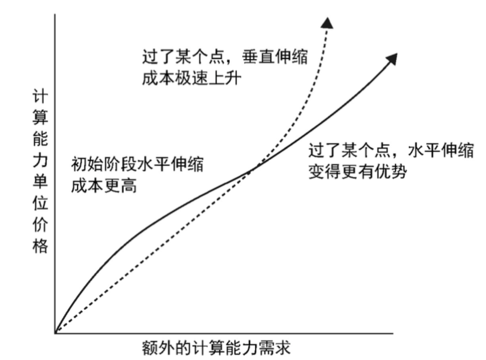

### 互联网面临的架构挑战
* 高并发 大流量
* 高可用
* 海量数据
* 用户分布广泛，网络情况复杂
* 安全环境恶劣
* 需求快速变更，发布频繁
* 渐进式发展：做架构时不需要一开始就做到面面俱到，先活下来才是王道。

### 应对高并发的技术方向
1. 垂直伸缩  
垂直伸缩对于个人来说是最容易被遗忘的手段，忋形成惯性思维首先考虑了水平伸缩。某些情况下却是能最快解决问题的。不改变架构，通过升级硬件或网络的吞吐能力来达到。如：
    * 使用RAID提高IO能力
    * 切换SSD提高IO能力
    * 加大内存减少IO
    * 升级网络带宽
    * 提升服务器性能  

2. 水平伸缩  
伸缩性圣杯，通过增加服务器提高计算能力

3. 垂直伸缩 vs 水平伸缩  

### 互联网架构演化阶段
0. 应用和数据库放在同一个服务器上
1. 应用 数据分离：部署到不同的服务器，分担计算和IO
2. 使用缓存：减少数据库IO
3. 使用应用集群：增大应用的吞量
4. 数据库读写分离：解决数据库目前瓶颈，对于一般互联网应用，大多是读多写少。但是会有短时间的数据不同步问题
5. 使用反向代理和CDN，增加反向代理缓冲，和运营商CDN操作，静态资源会放CDN上。静态资源发生变化后需要时间CDN才能生效。
6. 使用分布式文件系统和分布式数据库。如：分布式文件系统FastDFS（小文件）,Hadoop（大文件）和云解决方案. 分布式数据库待研究。
7. 使用NoSQL及搜索引擎。一般NoSQL放弃关系型数据库的ACID特性,有更好的性能和可伸缩性。
8. 业务拆分，按业务进行伸缩。分而做之，分而用之，分而治之
9. 微服务及中台化：会带来开发测试集成的复杂度。需要有很强的自动化(自动化测试，CI,CD X2)及服务治理

### 互联网架构模式
* 分层：每层负责比较单一的职责
* 分割：垂直拆分业务模块
* 分布式：分层，分割的最终目的。
* 集群：解决高并发及高可用 
* 缓存
* 异步
* 冗余
* 自动化
* 安全

### 互联网架构模量
* 高可用
* 高性能
* 可伸缩
* 可扩展
* 安全

### 互联网架构技术
1. 前端架构
* APP及Web开发技术
* 浏览器及HTTP优化技术
* CDN
* 动静分离
* 图片服务
* 反向代理
* DNS

2. 网关及应用层架构
* 网关架构
* 负载均衡
* 动态页面静态化
* 业务拆分

3. 服务层架构
* 微服务框架
* 分布式消息对列
* 分布式缓存
* 分布式一致性锁服务

4. 存储层架构
* 分布式文件
* 分布式关系型数据库
* NoSQL数据库

5. 后代架构
* 大数据平台
* 搜索引擎
* 推荐引擎
* 数据仓库

6. 运维与安全
* 数据采集与展示
* 数据监控与报警
* 攻击与防护
* 数据加密与解密

### 案例分享
架构案例分享部分的触动。工程师容易从技术角度解决问题，但技术不是最重要的，重要的是业务。宅米架构3.0中为什么没有选择分库分表，而是选择冷热分离。这让我想起之前看过的文章：架构设计的三个核心原则：
1. 合适原则
2. 简单原则
3. 演化原则