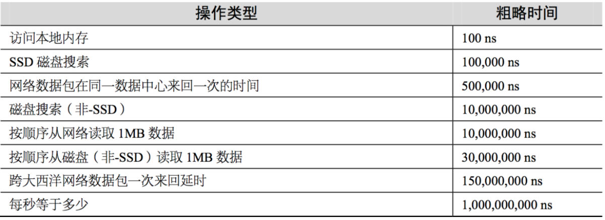
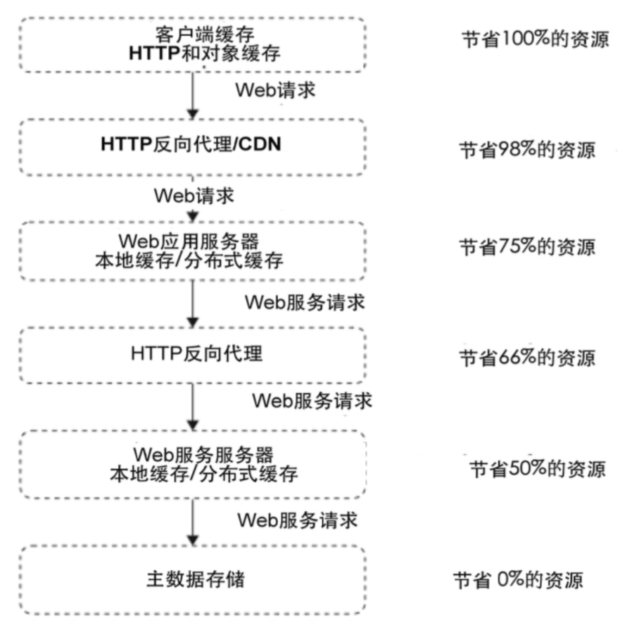

### 缓存 Cache
介于访问者和数据源之间的的高效存储，当需要多次读取时用来提高速度。

#### 无处不在的缓存
* CPU 缓存
* 操作系统缓存
* 数据库缓存
* JVM 编译缓存
* CDN 缓存
* 代理与反向代理缓存
* 前端缓存
* 应用程序缓存
* 分布式对象缓存

#### 缓存命中率的主要指标
* 缓存键集合大小  
应用生成的唯一键越多，重用的机会越小。例如，如果想基于客户 IP 地址缓存天气数据，则可能有多大 40 亿个键(这是所有可能 IP 地址的数量)。如果要基于客户来源国家缓存天气数据，则可能仅需几百个缓存键(世界上所有国家的数量)。一定要想办法减少可能的缓存数量。键数量越少，缓存的效率越高。
* 缓存可使用内存空间  
物理上能缓存的对象越多，缓存命中率就越高。
* 缓存对象生存时间  

#### 缓存分类  
* 通读缓存（Read-Through）  
    * 代理缓存，反向代理缓存，CDN 缓存都是通读缓存。
    * 通读缓存给客户端返回缓存资源，并在请求未命中缓存时获取实际数据。
    * 客户端连接的是通过缓存而不是生成相应的原始服务器  
      
* 旁路缓存（Cache-Aside）
    * 对象缓存是一种旁路缓存，旁路缓存通常是一个独立的键值对(Key-Value)存储。
    * 应用代码通常会询问对象缓存需要的对象是否存在，如果存在，它会获取并使用缓存的对象，如果不存在或已过期，应用会连接主数据源来组装对象，并将其保存回对象缓存中以便将来使用。

#### 各种介质数据访问延迟

#### 技术栈各个层次的缓存

#### 合理使用缓存
* 频繁修改的数据：这种数据如果缓存起来，由于频繁修改，应用还来不及读取就已经失效或更新，徒增系统负担。一般说来，数据的读写比在 2:1 以上，缓存才有意义。
* 没有热点的访问：缓存使用内存作为存储，内存的资源宝贵而有限，不能将所有数据都缓存起来，如果应用系统访问数据没有热点，不遵循二八定律，即大部分数据访问不是集中在小部分数据上，那么缓存就没有意义，因为大部分数据还没有被再次访问就已经被挤出缓存了。
* 数据不一致与脏读：应用要容忍一定时间的数据不一致，还要一种策略是数据更新时立即更新缓存，不过也会带来更多系统开销和事务一致性的问题。因此数据更新时通知缓存失效，删除该缓存数据，是一种更加稳妥的做法。
* 缓存穿透：缓存穿透是指缓存和数据库中都没有的数据，而用户不断发起请求，如发起为id为“-1”的数据或id为特别大不存在的数据。这时的用户很可能是攻击者，攻击会导致数据库压力过大。   
解决方案：
    * 接口层增加校验，如用户鉴权校验，id做基础校验，id<=0的直接拦截；
    * 从缓存取不到的数据，在数据库中也没有取到，这时也可以将key-value对写为key-null，缓存有效时间可以设置短点，如30秒（设置太长会导致正常情况也没法使用）。这样可以防止攻击用户反复用同一个id暴力攻击
* 缓存击穿：缓存击穿是指缓存中没有但数据库中有的数据（一般是缓存时间到期），这时由于并发用户特别多，同时读缓存没读到数据，又同时去数据库去取数据，引起数据库压力瞬间增大，造成过大压力   
解决方案：   
    * 设置热点数据永远不过期。  
    * 加互斥锁
* 缓存雪崩：缓存雪崩是指缓存中数据大批量到过期时间，而查询数据量巨大，引起数据库压力过大甚至down机。和缓存击穿不同的是，缓存击穿指并发查同一条数据，缓存雪崩是不同数据都过期了，很多数据都查不到从而查数据库。  
解决方案：
    * 缓存数据的过期时间设置随机，防止同一时间大量数据过期现象发生。  
    * 如果缓存数据库是分布式部署，将热点数据均匀分布在不同搞得缓存数据库中。  
    * 设置热点数据永远不过期。
* 缓存预热：缓存中存放的是热点数据，热点数据又是缓存系统利用 LRU （最近最久未用）算法对不断访问的数据筛选淘汰出来的，这个过程需要花费较长的时间，在这段时间，系统的性能和数据库负载都不太好，那么最好的缓存系统启动的时候就把热点数据加载好，这个缓存预加载叫做缓存预热（Warm up）。对于一些元数据，比如城市地名列表、类目信息，可以启动时加载数据库中全部数据到缓存进行预热。

### 消息对例与异步缓存

#### 消息队列的好处
* 实现异步处理，提升写操作处理性能（缓存提升的是读的性能，消息队列提升的是写的性能）。
* 更好的伸缩性
* 削峰填谷
* 失败隔离和自我修复
* 解耦，同步调用耦合度高、事件驱动异步调用耦合度低。减少耦合表面积

### 负载均衡
#### HTTP 重定向负载均衡
1. 用户访问一个http请求，DNS解析域名为ip地址，ip地址指向负载均衡服务器；
2. 负责均衡服务器，获取服务器集群列表，修改http的header为集群中的某台的服务器地址，告诉客户端做302跳转；
3. 客户端请求集群中的某台的服务器
4. 集群中的某台的服务器处理完后，返回response。  

缺点：  
1、 两次http请求，性能差。  
2、 暴露了应用服务器的公网ip，安全性很差。  

#### DNS 负载均衡
可以做两级负载，DNS配置多台负载均衡服务器地址。 

缺点在于当后端服务器宕机后，很难让DNS感知。

#### 反向代理负载均衡
小型应用会用，通常10几台应用服务器的时候会用。多了以后就不够用了。  
反向代理服务器转发的是http请求，http请求每次通信的时间比较慢，对反向代理服务器的压力比较大。当并发比较高的时候，反向代理服务器就会成为瓶颈。

#### IP 负载均衡
TCP/IP 的数据包比较小，一般是几K。
1. 客户端发起请求，请求到达负载均衡服务器，负载均衡服务器修改发起的ip为自己，目标地址为应用服务器。
2. 应用服务器处理请求后返回给负载均衡服务器，负载均衡服务器修改发起的ip为客户端，目标地址为负载均衡服务器，返回给客户端。  
缺点：
请求和响应的压力都在负载均衡服务器。负载均衡服务器，网卡的出口网络带宽会不够用。

#### 数据链路层负载均衡
1. 客户端请求到达负载均衡服务器，负载均衡服务器的网卡和应用服务器的网卡为一样，这是虚拟网卡。修改Mac地址，分发给应用服务器，达到负载均衡。
2. 应用服务器处理完后，直接返回给客户端。

### 分布式数据库

#### 一主多从
* 分摊负载  
* 专机专用  
* 便于热备份和冷备分  
* 高可用  

#### 主主复制
* 主主复制的两个数据库不能并发写入。  
* 主主复制/主从复制，只是增加了数据的读并发处理能力，没有增加写并发能力和存储能力。  
* 更新表结构会导致巨大的同步延迟。  