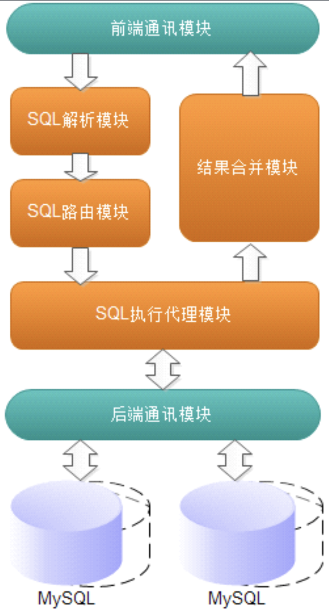
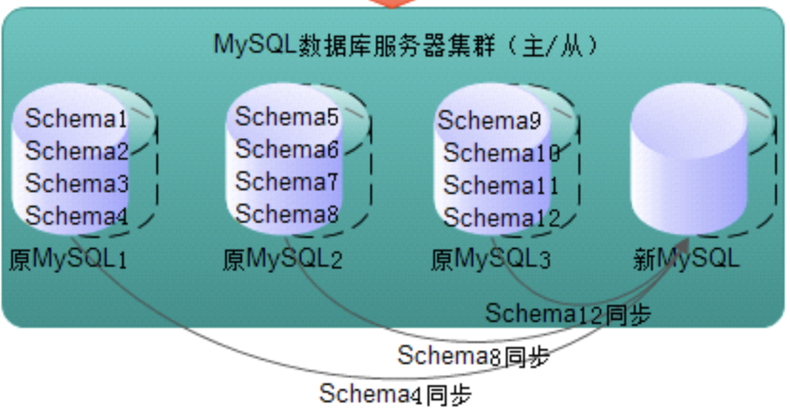
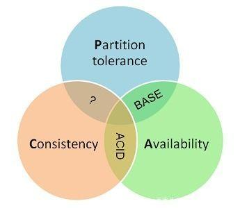

#### 数据分片
##### 数据分片的挑战
* 需要大量的额外代码，处理逻辑会更复杂
* 无法执行多分片的联合查询
* 无法执行跨库事务
* 随着数据增长，如何增加更多的服务器。数据如何做迁移。
##### 数据分片方式
* 硬编码方式  
当增加服务器会进行大量的数据迁移。
* 映射表外部存储
两次查询，性能不是很好。
##### 分布式数据库中间件
* mycat  

* 实践中的扩容  

#### CAP
分布式系统的CAP理论首先把分布式系统中的三个特性进行了如下归纳：
* 一致性（C）：在分布式系统中的所有数据备份，在同一时刻是否所有节点访问同一份最新的数据
* 可用性（A）：在集群中一部分节点故障后，集群整体是否还能响应客户端的读写请求。
* 分区容忍性（P）：在网络故障发生的情况下，系统如果不能在时限内达成数据一致性，就意味着发生了分区的情况，必须就当前操作在C和A之间做出选择。

在一个分布式系统中，最多只能满足其中两个属性。  

